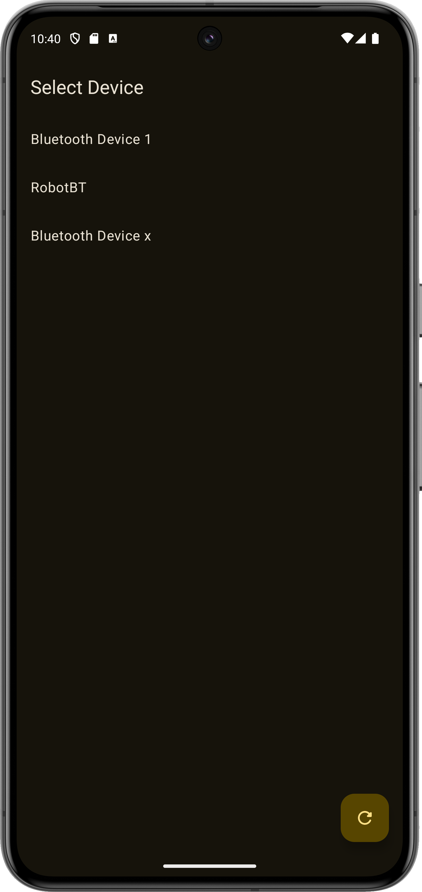
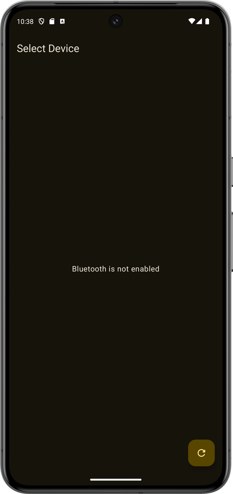
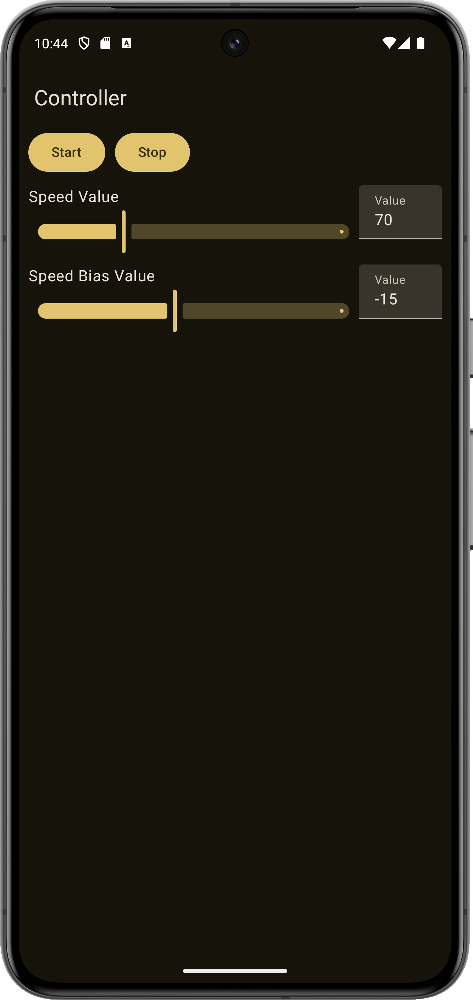

# Bakar Controller

Controller app for 

 &nbsp;  &nbsp; 

## Controls

This application is used to control start and stop for the robot, there is also speed control and speed bias control.

Speed bias value is used to control if the left/right wheel is faster, negative for left, and positive for right.

## Warning
This application is written for learning purposes only and is **very buggy**.